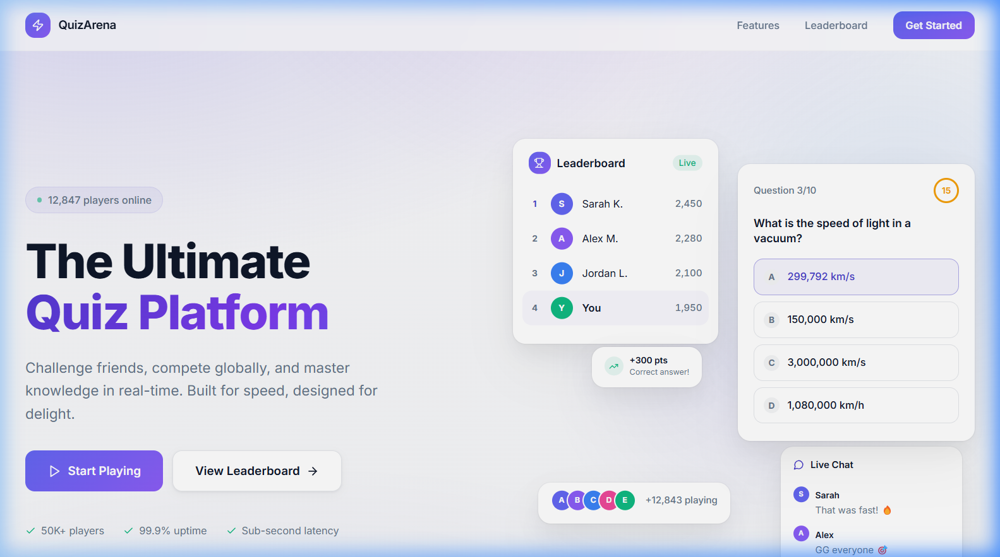
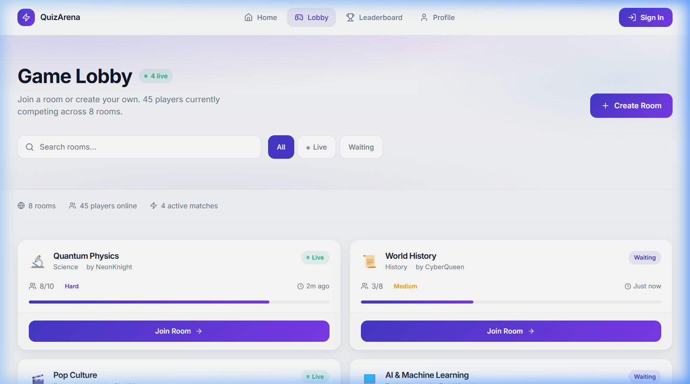
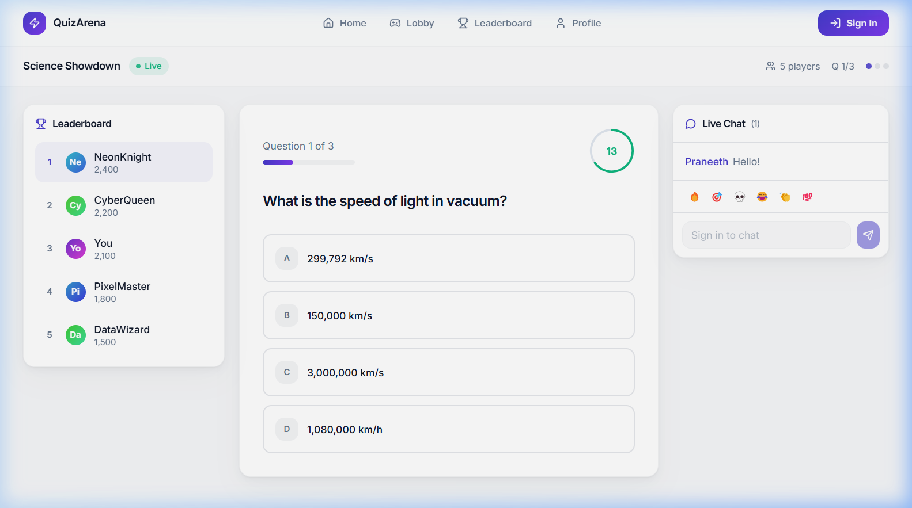
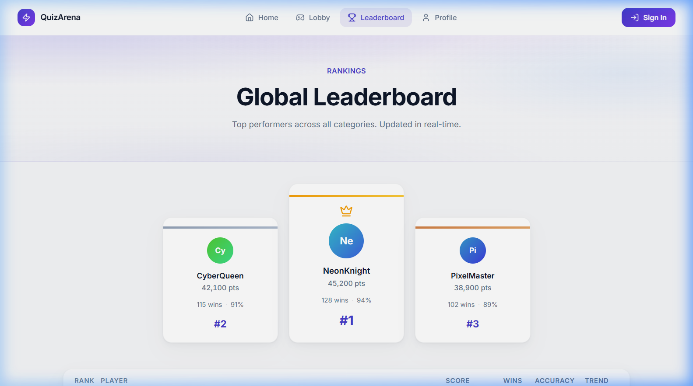
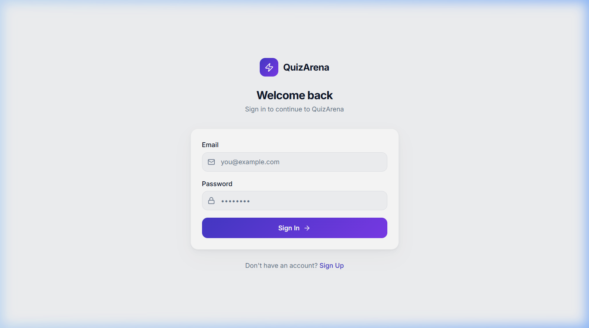
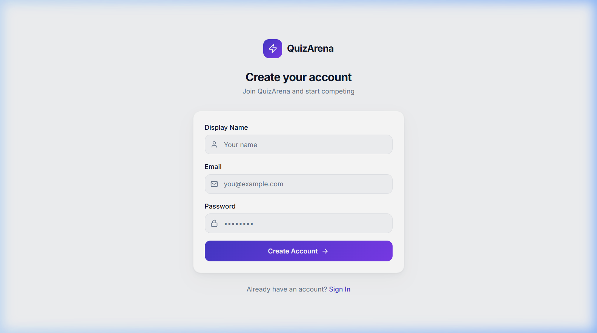

# ⚡ QuizArena – Neon Arena Quizzes

> A real-time, multiplayer quiz battle platform built with a modern full-stack JavaScript ecosystem. Compete against others in themed quiz rooms, climb the global leaderboard, and track your performance – all in a stunning neon-dark UI.

---

## 📋 Table of Contents

1. [Project Overview](#project-overview)
2. [Tech Stack](#tech-stack)
3. [Architecture](#architecture)
4. [Features](#features)
5. [Project Structure](#project-structure)
6. [Database Schema](#database-schema)
7. [Pages & Routes](#pages--routes)
8. [Components](#components)
9. [Hooks](#hooks)
10. [Authentication](#authentication)
11. [Getting Started](#getting-started)
12. [Available Scripts](#available-scripts)
13. [Environment Variables](#environment-variables)

---

## 📸 Screenshots

| Landing Page | Lobby |
|:---:|:---:|
|  |  |

| Quiz Room | Leaderboard |
|:---:|:---:|
|  |  |

| Sign In | Sign Up |
|:---:|:---:|
|  |  |

---

## Project Overview

**QuizArena** is a competitive, real-time quiz game where players join themed rooms, answer timed questions, and compete for the top spot on a live leaderboard. The app is designed to feel fast and premium, using smooth animations and a vibrant neon-dark aesthetic.

### Core User Flows

| Flow | Description |
|------|-------------|
| **Auth** | Users sign up / sign in via Supabase Auth |
| **Lobby** | Browse/search/filter quiz rooms by status, category, or difficulty |
| **Quiz Room** | Answer timed multiple-choice questions; real-time leaderboard & chat |
| **Leaderboard** | View global rankings with podium and trend indicators |
| **Profile** | View personal stats, badges earned, match history, and category performance |

---

## 🛠 Tech Stack

### Frontend – JavaScript / TypeScript

| Technology | Version | Purpose |
|---|---|---|
| **JavaScript / TypeScript** | TypeScript `^5.8.3` | Primary language for all frontend logic and type safety |
| **React** | `^18.3.1` | Core UI library – component-based architecture |
| **React DOM** | `^18.3.1` | React renderer for the browser |
| **React Router DOM** | `^6.30.1` | Client-side routing and navigation |
| **Vite** | `^5.4.19` | Ultra-fast build tool and dev server |

### State Management & Data Fetching – JavaScript

| Technology | Version | Purpose |
|---|---|---|
| **TanStack React Query** | `^5.83.0` | Server state management, caching, and sync |
| **Zustand** | `4.5.2` | Lightweight global client-side state store |
| **React Hook Form** | `^7.61.1` | Performant form state management |
| **Zod** | `^3.25.76` | Schema validation for forms and API data |

### UI & Styling – JavaScript / CSS

| Technology | Version | Purpose |
|---|---|---|
| **Tailwind CSS** | `^3.4.17` | Utility-first CSS framework |
| **shadcn/ui** | (via components.json) | Accessible, composable Radix UI component system |
| **Radix UI** | Multiple packages | Headless accessible UI primitives |
| **Framer Motion** | `^12.35.1` | Production-grade animations and transitions |
| **Lucide React** | `^0.462.0` | Open-source icon library |
| **Tailwind Animate** | `^1.0.7` | CSS keyframe animation utility classes |
| **class-variance-authority** | `^0.7.1` | Type-safe CSS variant management |
| **clsx + tailwind-merge** | Latest | Conditional className composition |
| **next-themes** | `^0.3.0` | Dark/light theme switching |
| **Recharts** | `^2.15.4` | Charting and data visualization |
| **Embla Carousel** | `^8.6.0` | Touch-friendly carousels |

### 3D & Animation

| Technology | Version | Purpose |
|---|---|---|
| **Three.js** | `^0.160.0` | 3D graphics engine |
| **@react-three/fiber** | `^8.18.0` | React renderer for Three.js |
| **@react-three/drei** | `^9.122.0` | Useful Three.js helpers for React |

### Backend & Database

| Technology | Version | Purpose |
|---|---|---|
| **Supabase** | `^2.98.0` | Backend-as-a-Service (Auth, PostgreSQL DB, Realtime) |
| **PostgreSQL** | (via Supabase) | Relational database for all app data |

### Tooling & Dev

| Technology | Version | Purpose |
|---|---|---|
| **TypeScript** | `^5.8.3` | Static type checking across all `.ts`/`.tsx` files |
| **ESLint** | `^9.32.0` | Code linting (React hooks & refresh plugins) |
| **Vitest** | `^3.2.4` | Fast unit test runner (Vite-native) |
| **@testing-library/react** | `^16.0.0` | React component testing utilities |
| **jsdom** | `^20.0.3` | DOM simulation for tests |
| **PostCSS + Autoprefixer** | Latest | CSS processing pipeline |
| **Bun** | (lockfile present) | Alternative JS runtime / package manager |

---

## Architecture

```
Browser (React SPA)
        │
        ▼
  React Router v6        ← Client-side routing
        │
  AuthProvider (Context) ← Session / user state from Supabase Auth
        │
  QueryClientProvider    ← TanStack Query for server state
        │
   ┌────┴────────────────────────────────┐
   │              Pages                  │
   │  Landing · Lobby · QuizRoom         │
   │  Leaderboard · Profile · Sign-in    │
   └──────────────┬──────────────────────┘
                  │
        Components (game / layout / animations / ui)
                  │
        Supabase JS Client
                  │
        Supabase Cloud (PostgreSQL + Auth + Realtime)
```

---

## Features

### 🏠 Landing Page
- Animated hero section with a **Three.js 3D scene**
- Floating particle effects & custom cursor
- Animated statistics with `CountUp` numbers
- Feature highlights, game mode cards, and CTA buttons

### 🎮 Game Lobby (`/lobby`)
- Browse all available quiz rooms in a **responsive card grid** (1 → 2 → 3 columns)
- **Live/Waiting** status badges with animated pulse dot
- **Search** rooms by name and **filter** by status (All / Live / Waiting)
- Animated capacity progress bar per room
- Quick stats bar: total rooms, players online, active matches
- Category emoji icons; difficulty colour-coded chips (Easy / Medium / Hard / Expert)

### 🧠 Quiz Room (`/room/:roomId`)
- Timed multiple-choice questions (20 seconds per question)
- Auto-advance when time runs out; correct answer revealed
- **Scoring** – +300 pts for correct answers
- Desktop: **3-column layout** (Leaderboard | Quiz Card | Chat)
- Mobile: **tabbed navigation** (Quiz / Rankings / Chat)
- Progress dots showing current question position
- Real-time leaderboard sidebar with animated rankings
- In-room chat panel via Supabase

### 🏆 Leaderboard (`/leaderboard`)
- **Animated podium** for Top 3 players (gold/silver/bronze)
- `CountUp` score animations on mount
- Full ranked table (rank 4+) with trend arrows (↑ / ↓ / –)
- Displays: score, wins, accuracy, and game count

### 👤 Profile (`/profile`)
- Player avatar, level, XP progress bar
- 4-stat summary cards: Games Played, Win Rate, Accuracy, Win Streak
- **Recent Matches** list with result badges (1st/2nd/3rd/4th)
- **Category Performance** animated progress bars
- **Badges Earned** panel (Champion, Speed Demon, Sharpshooter, etc.)
- Quick stats sidebar: best score, avg answer time, total points, perfect games

### 🔐 Authentication (`/signin` & `/signup`)
- Email + password login and registration via Supabase Auth
- Display name captured on sign-up (stored as user metadata)
- `AuthProvider` context exposes `signUp`, `signIn`, `signOut`
- Session persisted automatically; profile fetched on auth state change

---

## Project Structure

```
neon-arena-quizzes/
├── public/                        # Static assets
├── src/
│   ├── App.tsx                    # Root component – router & providers
│   ├── main.tsx                   # React entry point
│   ├── index.css                  # Global styles & CSS variables
│   ├── App.css                    # App-level styles
│   │
│   ├── pages/
│   │   ├── Landing.tsx            # Home / hero page
│   │   ├── Lobby.tsx              # Quiz room browser
│   │   ├── QuizRoom.tsx           # Live quiz game room
│   │   ├── Leaderboard.tsx        # Global rankings
│   │   ├── Profile.tsx            # Player profile & stats
│   │   ├── SignIn.tsx             # Login page
│   │   ├── SignUp.tsx             # Registration page
│   │   ├── Index.tsx              # Route re-export
│   │   └── NotFound.tsx           # 404 page
│   │
│   ├── components/
│   │   ├── NavLink.tsx            # Styled navigation link
│   │   ├── layout/
│   │   │   └── AppShell.tsx       # Global nav bar & page wrapper
│   │   ├── game/
│   │   │   ├── QuizCard.tsx       # Question card with timer ring
│   │   │   ├── AnimatedLeaderboard.tsx  # Live in-room ranking list
│   │   │   ├── ChatPanel.tsx      # Real-time in-room chat
│   │   │   ├── TimerRing.tsx      # SVG countdown ring component
│   │   │   ├── PowerUpBar.tsx     # Power-up buttons strip
│   │   │   ├── PlayerAvatar.tsx   # Player avatar with gradient
│   │   │   └── RoomCard.tsx       # Lobby room preview card
│   │   └── animations/
│   │       ├── AnimatedButton.tsx        # Framer Motion button
│   │       ├── AnimatedPageTransition.tsx # Page fade/slide transition
│   │       ├── CountUp.tsx               # Animated number counter
│   │       ├── CustomCursor.tsx          # Custom cursor effect
│   │       ├── FloatingParticles.tsx     # Canvas particle background
│   │       └── Hero3DScene.tsx           # Three.js 3D hero scene
│   │
│   ├── hooks/
│   │   ├── useAuth.tsx            # Auth context & hook (sign in/up/out)
│   │   ├── use-toast.ts           # Toast notification hook
│   │   └── use-mobile.tsx         # Responsive breakpoint hook
│   │
│   ├── integrations/
│   │   └── supabase/
│   │       ├── client.ts          # Supabase JS client singleton
│   │       └── types.ts           # Auto-generated DB TypeScript types
│   │
│   ├── lib/
│   │   └── utils.ts               # Utility: cn() class merger
│   │
│   └── test/                      # Vitest test files
│
├── supabase/
│   ├── config.toml                # Supabase local config
│   └── migrations/                # SQL migration files
│       ├── 20260308171512_*.sql   # Initial schema
│       ├── 20260308175327_*.sql   # Migration 2
│       └── 20260308175427_*.sql   # Migration 3
│
├── index.html                     # HTML entry point
├── vite.config.ts                 # Vite configuration
├── tailwind.config.ts             # Tailwind CSS configuration
├── tsconfig.json                  # TypeScript base config
├── tsconfig.app.json              # App TypeScript config
├── tsconfig.node.json             # Node TypeScript config
├── postcss.config.js              # PostCSS pipeline
├── eslint.config.js               # ESLint rules
├── vitest.config.ts               # Vitest configuration
├── components.json                # shadcn/ui config
├── package.json                   # Dependencies & scripts
└── .env                           # Environment variables (not committed)
```

---

## Database Schema

All tables live in the Supabase **public** schema (PostgreSQL).

### `profiles`
Stores extended player data, created automatically on sign-up via database trigger.

| Column | Type | Description |
|--------|------|-------------|
| `id` | `uuid` | Primary key |
| `user_id` | `uuid` | FK → Supabase auth user |
| `display_name` | `text` | Public player name |
| `avatar_url` | `text?` | Avatar image URL |
| `bio` | `text?` | Player bio |
| `games_played` | `int` | Total games entered |
| `games_won` | `int` | Total wins |
| `total_correct` | `int` | Lifetime correct answers |
| `total_answered` | `int` | Lifetime questions answered |
| `created_at` | `timestamp` | Account creation time |
| `updated_at` | `timestamp` | Last update time |

### `quiz_rooms`
Represents a quiz session/room.

| Column | Type | Description |
|--------|------|-------------|
| `id` | `uuid` | Primary key |
| `name` | `text` | Room display name |
| `host_id` | `uuid` | User who created the room |
| `category` | `text` | Quiz topic category |
| `difficulty` | `text` | Easy / Medium / Hard / Expert |
| `max_players` | `int` | Player capacity |
| `status` | `text` | `waiting` or `live` |
| `created_at` | `timestamp` | Room creation time |
| `updated_at` | `timestamp` | Last update time |

### `room_players`
Junction table linking players to rooms.

| Column | Type | Description |
|--------|------|-------------|
| `id` | `uuid` | Primary key |
| `room_id` | `uuid` | FK → `quiz_rooms.id` |
| `user_id` | `uuid` | FK → auth user |
| `score` | `int` | Player's score in this room |
| `joined_at` | `timestamp` | When they joined |

### `quiz_questions`
Individual questions belonging to a room.

| Column | Type | Description |
|--------|------|-------------|
| `id` | `uuid` | Primary key |
| `room_id` | `uuid` | FK → `quiz_rooms.id` |
| `question_text` | `text` | The question string |
| `options` | `json` | Array of answer strings |
| `correct_answer` | `int` | Index of the correct option |
| `question_order` | `int` | Position in the quiz |
| `time_limit` | `int` | Seconds allowed |
| `created_at` | `timestamp` | Created time |

### `quiz_answers`
Records each player's answer per question.

| Column | Type | Description |
|--------|------|-------------|
| `id` | `uuid` | Primary key |
| `question_id` | `uuid` | FK → `quiz_questions.id` |
| `user_id` | `uuid` | The answering user |
| `selected_answer` | `int` | Index of chosen option |
| `is_correct` | `bool` | Whether the answer was correct |
| `answered_at` | `timestamp` | Timestamp of answer |

### `chat_messages`
In-room chat history.

| Column | Type | Description |
|--------|------|-------------|
| `id` | `uuid` | Primary key |
| `room_id` | `uuid` | The room this message belongs to |
| `user_id` | `uuid` | Sender |
| `message` | `text` | Message content |
| `created_at` | `timestamp` | Sent at |

### `leaderboard_scores`
Aggregated lifetime scores for the global leaderboard.

| Column | Type | Description |
|--------|------|-------------|
| `id` | `uuid` | Primary key |
| `user_id` | `uuid` | The player |
| `total_score` | `int` | Cumulative score |
| `wins` | `int` | Total wins |
| `games_played` | `int` | Total games |
| `updated_at` | `timestamp` | Last updated |

---

## Pages & Routes

| Route | Component | Auth Required | Description |
|-------|-----------|---------------|-------------|
| `/` | `Landing` | No | Hero / marketing home page |
| `/signin` | `SignIn` | No | Email + password login |
| `/signup` | `SignUp` | No | New account registration |
| `/lobby` | `Lobby` | Recommended | Browse and join quiz rooms |
| `/room` | `QuizRoom` | Recommended | Demo quiz room |
| `/room/:roomId` | `QuizRoom` | Recommended | Specific quiz room by ID |
| `/leaderboard` | `Leaderboard` | No | Global rankings table |
| `/profile` | `Profile` | Yes | Personal stats and history |
| `*` | `NotFound` | No | 404 fallback |

---

## Components

### Layout

#### `AppShell`
The top-level layout wrapper used by every page. Renders:
- **Fixed top navigation bar** with the QuizArena logo and nav items
- Displays logged-in user's display name / avatar or a **Sign In** CTA
- **Sign Out** button that clears the session and redirects to `/`
- A `<main>` tag with `pt-16` to offset the fixed navbar

### Game

| Component | Description |
|-----------|-------------|
| `QuizCard` | Displays one question, its options, and the `TimerRing`. Highlights correct/wrong answers after submission |
| `TimerRing` | SVG circular countdown ring that depletes as time runs out |
| `AnimatedLeaderboard` | Live score list for players currently in the room |
| `ChatPanel` | Real-time chat window connected to Supabase Realtime |
| `PowerUpBar` | Row of power-up action buttons (time freeze, skip, etc.) |
| `PlayerAvatar` | Gradient-coloured circular avatar with initials |
| `RoomCard` | Preview card for a quiz room shown in the lobby grid |

### Animations

| Component | Description |
|-----------|-------------|
| `AnimatedButton` | Framer Motion button with hover/tap scale effects |
| `AnimatedPageTransition` | Wraps page content in a fade + slide transition |
| `CountUp` | Animates a number from 0 to a target value on mount |
| `CustomCursor` | Replaces the default cursor with a neon glow dot |
| `FloatingParticles` | Canvas-based animated particle background |
| `Hero3DScene` | Three.js 3D scene rendered in the landing page hero |

---

## Hooks

### `useAuth`
Provides authentication state and methods via React Context.

```ts
const { session, user, profile, loading, signUp, signIn, signOut } = useAuth();
```

| Property | Type | Description |
|----------|------|-------------|
| `session` | `Session \| null` | Current Supabase session |
| `user` | `User \| null` | Authenticated Supabase user object |
| `profile` | `Profile \| null` | Extended profile from `profiles` table |
| `loading` | `boolean` | True while auth state is being resolved |
| `signUp(email, password, displayName)` | `Promise` | Create a new account |
| `signIn(email, password)` | `Promise` | Log into existing account |
| `signOut()` | `Promise<void>` | Clear session and log out |

### `use-toast`
Exposes `toast()` and `useToast()` for displaying notification toasts from anywhere in the app.

### `use-mobile`
Returns `isMobile: boolean` based on a `768px` `window.matchMedia` breakpoint. Used for responsive logic in JavaScript.

---

## Authentication

Authentication is handled end-to-end by **Supabase Auth**:

1. **Sign Up** – `supabase.auth.signUp()` with `display_name` passed as user metadata. A database trigger auto-creates a row in the `profiles` table.
2. **Sign In** – `supabase.auth.signInWithPassword()`, returns a JWT session.
3. **Session Persistence** – Supabase stores the session in `localStorage` and refreshes it automatically.
4. **Auth State Listener** – `supabase.auth.onAuthStateChange()` keeps the React context in sync.
5. **Profile Fetch** – On every auth state change, the app fetches the user's extended profile from `profiles` table.

---

## Getting Started

### Prerequisites

- **Node.js** ≥ 18 (or **Bun** ≥ 1.0)
- A **Supabase** project with the schema applied

### Installation

```bash
# Clone the repository
git clone <repo-url>
cd neon-arena-quizzes

# Install dependencies
npm install
# or with Bun
bun install
```

### Configure Environment

Create a `.env` file in the project root (see [Environment Variables](#environment-variables)):

```bash
cp .env.example .env
# Fill in your Supabase URL and Anon Key
```

### Apply Database Migrations

Using the Supabase CLI:

```bash
supabase db push
```

Or run the SQL files in `supabase/migrations/` manually in your Supabase SQL Editor.

### Start Development Server

```bash
npm run dev
# or
bun run dev
```

Open [http://localhost:5173](http://localhost:5173) in your browser.

---

## Available Scripts

| Script | Command | Description |
|--------|---------|-------------|
| **dev** | `npm run dev` | Start Vite dev server with HMR |
| **build** | `npm run build` | Production build to `dist/` |
| **build:dev** | `npm run build:dev` | Development build |
| **preview** | `npm run preview` | Preview the production build locally |
| **lint** | `npm run lint` | Run ESLint across all source files |
| **test** | `npm run test` | Run all tests once with Vitest |
| **test:watch** | `npm run test:watch` | Run tests in watch mode |

---

## Environment Variables

| Variable | Description |
|----------|-------------|
| `VITE_SUPABASE_URL` | Your Supabase project URL (e.g. `https://xxxx.supabase.co`) |
| `VITE_SUPABASE_ANON_KEY` | Your Supabase project's public anon key |

These are accessed in code as `import.meta.env.VITE_SUPABASE_URL` (Vite convention).

> **Never commit your `.env` file.** It is already listed in `.gitignore`.

---

## License

This project is private. All rights reserved.
